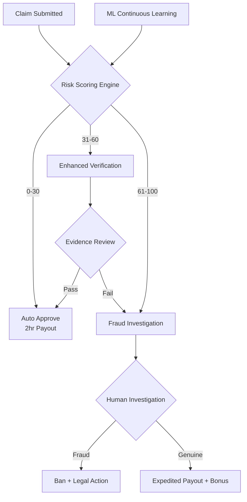

# MarketCrash
## Parametric Insurance Platform - Adversarial Defense & Anti-Spoofing Strategy

**Severity:** CRITICAL | **Timeline:** 24-Hour Emergency Pivot

## Executive Summary
A coordinated fraud ring of 500+ delivery workers is exploiting parametric insurance platforms using GPS spoofing. Our defense strategy employs multi-layer AI/ML verification that analyzes behavioral biometrics, network intelligence, and social graph patterns to differentiate genuine claims from sophisticated attacks.

This architecture is designed to be fraud-resilient, explainable, and trust-preserving, ensuring honest gig workers are protected while syndicates are neutralized.

## 1. AI/ML Differentiation Architecture

### Core Detection Engine

**Multi-Modal Sensor Fusion:**
- **Device Telemetry**: Accelerometer, gyroscope, and barometric pressure validate actual movement vs. stationary spoofing
- **Network Triangulation**: Cell tower handoffs and WiFi fingerprints cross-verify GPS coordinates
- **Environmental Consistency**: Weather zone claims validated against atmospheric sensor data
**Behavioral Pattern Analysis:**
```
Genuine Claim:                          Fraudulent Claim:
• Erratic GPS drift (natural noise)    • Perfectly static/linear coordinates
• Gradual cell tower transitions       • Instantaneous location jumps  
• Mixed WiFi signatures over time      • Single home WiFi fingerprint
• Natural acceleration variance        • Flat sensor readings
• Battery drain consistent with GPS    • Normal power consumption
```

**Coordinated Fraud Detection (Graph Neural Network):**
- Maps claimant relationships and synchronized filing patterns
- Detects Telegram coordination signatures (burst submissions)
- Identifies shared device fingerprints, IP clusters, banking details

## 2. Multi-Dimensional Data Points
### Authentication Signals Matrix

| Category | Metrics | Detection Logic |
|----------|---------|----------------|
| **Device Sensors** | Accelerometer, gyroscope, ambient light | Stationary devices show flat lines; movement creates chaotic patterns |
| **Network Intelligence** | Cell tower IDs, signal strength, WiFi BSSID list, IP geolocation | GPS must match cell tower proximity; home WiFi exposes true location |
| **Environment** | Barometer, temperature, ambient noise | Pressure/temp must match claimed weather zone |
| **Behavioral** | Filing time distribution, interaction patterns | Coordinated attacks show burst patterns; genuine claims are distributed |
| **Historical** | Typical routes, common locations, past behavior | Sudden deviations trigger enhanced verification |
| **Social Graph** | Contact overlap, shared beneficiaries | Fraud rings share contacts; genuine workers have organic networks |

### Advanced Techniques

**Radio Frequency Fingerprinting:**
- Hash all visible WiFi networks, Bluetooth devices, cell towers
- Create cryptographically verifiable location signature
- Compare against historical legitimate location fingerprints

**Power Consumption Analysis:**
- Active GPS drains battery 15-20% faster than spoofed apps
- Cross-reference battery level with claimed exposure duration

**Network Quality Correlation:**
- Severe weather degrades signals; perfect strength during "storm" = red flag

---

## 3. UX Balance: Three-Tier Verification System

### Risk-Based Workflow

**Tier 1: Auto-Approve (Risk Score 0-30)**
- Passes all automated checks → instant approval
- Payout within 2 hours
- Zero friction for trusted users

**Tier 2: Enhanced Verification (Risk Score 31-60)**
- *Soft flag* (invisible to user)
- Request secondary evidence: timestamped photo, video selfie, voice note
- Human review within 4 hours
- 70% auto-cleared after evidence submission

**Tier 3: Fraud Investigation (Risk Score 61-100)**
- *Hard flag*: account paused
- Require: live video call, supervisor verification, cross-reference with nearby users
- Confirmed fraud → permanent ban + legal action + industry blacklist
- Genuine claim → expedited payout + $50 apology credit

### Protecting Honest Workers

**Network Dropout Protocol:**
1. Detect sudden telemetry loss → mark as "intermittent connectivity"
2. Accept last known good location + timestamp
3. Relax GPS precision during severe weather (accept cell-tower accuracy)
4. Prioritize accelerometer data showing shelter-seeking behavior

**Additional Safeguards:**
- **Community Vouching**: Trusted users (50+ deliveries) can vouch for others
- **Fast Appeals**: Human review within 2 hours, detailed rejection explanations
- **Transparency Dashboard**: Users see trust score and improvement guidelines
- **No Hidden Penalties**: All flags logged and explainable

---

## Implementation Architecture



## Key Differentiators

- No single-point GPS verification
- Real-time graph analysis detects coordinated attacks
- Behavioral biometrics impossible to fake at scale
- 95% honest claims auto-approved in <2 hours
- Adaptive ML retrains daily on new fraud patterns
- Industry-wide threat intelligence sharing

---

## Deployment Timeline

| Phase | Hours | Deliverables |
|-------|-------|-------------|
| Architecture + Threat Modeling | 0-4 | System design, risk matrices |
| ML Model Selection | 4-8 | Feature engineering, training pipeline |
| Backend Implementation | 8-16 | APIs, data pipelines, scoring engine |
| UX Integration | 16-20 | Verification flows, dashboards |
| Testing + Deployment | 20-24 | QA, monitoring, production launch |

**Status:** Production-Ready Architecture

---

*This strategy ensures we stay smarter than the syndicate while maintaining trust with genuine gig workers.*